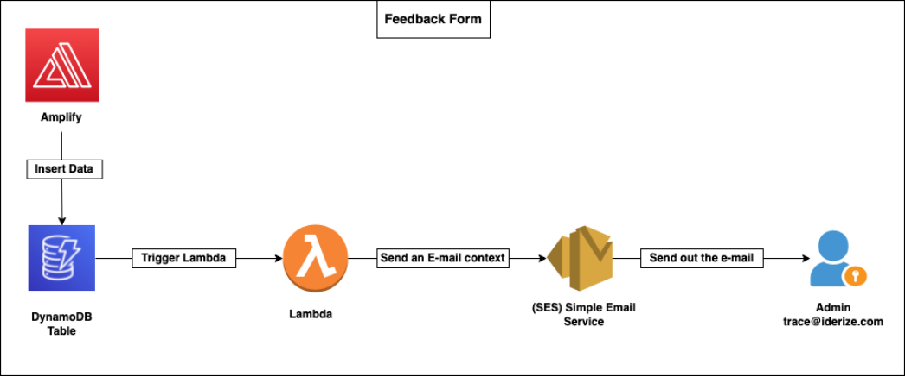

# dynamodb-trigger-lambda-SES
Whenever there is an entry in dynamo_db, lambda gets triggered and sends out an email with the required information.

# Architecture

# Set up
1.Analyze the AWS Amplify and AppSync setup. (Process of pushing data into the Dynamo-db Table).
2.Examine the format and schema of data.
3.Create a lambda and provide LambdaExecutionRole with DynamoDBFullAceess to achieve integration.
4.Configure the trigger as Dynamo-db Table.
5.To achieve lambda integration with SES, provide SESFullAccess to LambdaExecutionRole.
6.Add identities in SES i.e., source and destination mail addresses.
7.Make sure to verify the mail address by confirming the URL in the mail which has been sent by SES.
8.Now hop on the lambda we have created, write logic to fetch the data from Dynamo Db Table and send the email context to SES.
9.Post that SES sends out the mail to the destination mail address.
10.Insert a sample data in the Dynamo-db table that triggers the lambda and sends out the mail.
11.You will receive the e-mail in few seconds.
12.Reference - 1) https://betterprogramming.pub/send-emails-serverlessly-with-node-js-lambda-and-aws-ses-186cba40d695 2) https://blog.focusotter.com/serverless-contact-form-using-aws-amplify

Happy mailing!!!!!
